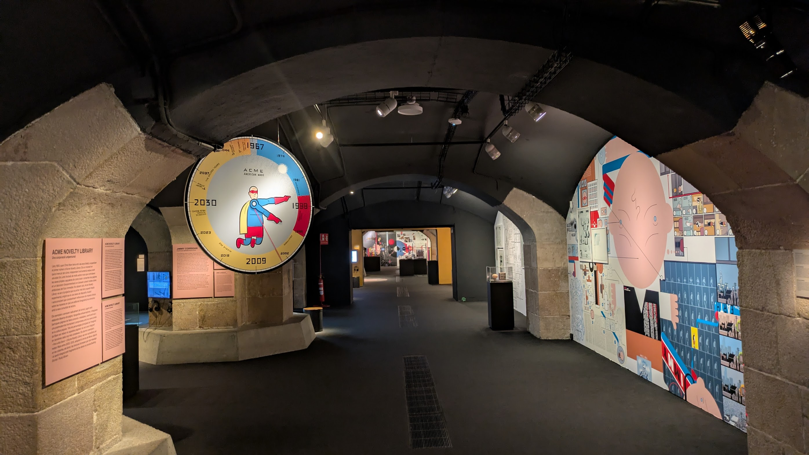
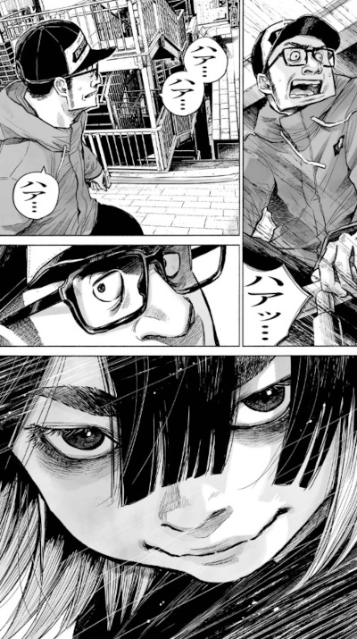
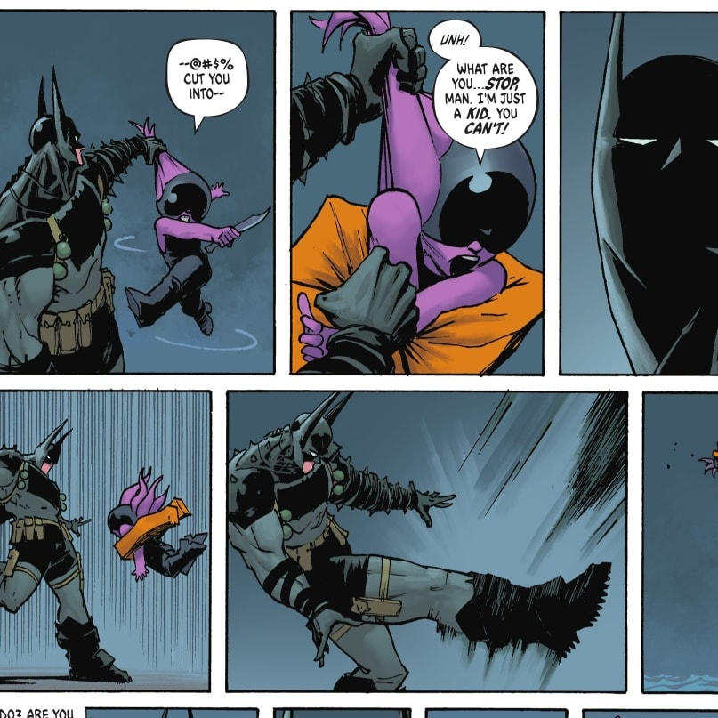
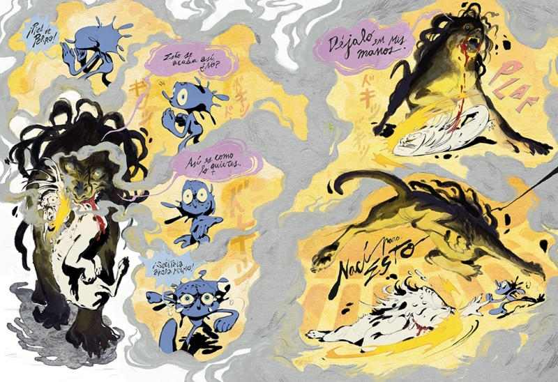
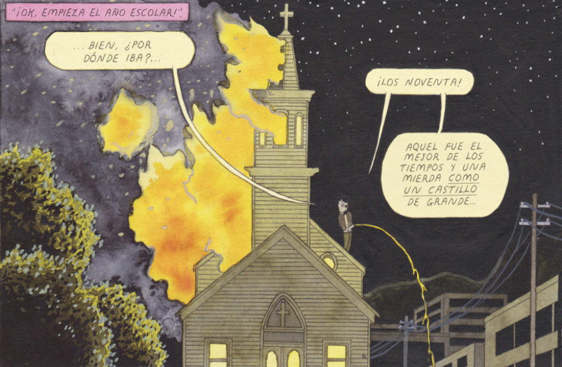

Como todos los años, mis lecturas comiqueras no se han encuadrado tanto en las novedades editoriales como en lo que me ha ido dando la gana leer. No sé si es la edad, pero ya uno va viendo como todos los meses te intentan colocar supuestos clásicos contemporáneos que no son tales o prometedores números 1 de colecciones que luego se desinflan. Así que de unos años para acá mi estrategia es esperar a que los *FOMOs* se asienten y a ver qué pasa. Dicho esto, vayamos por partes:

## (Re)descubriendo popes indies

En 2025 he leído bastantes autores imprescindibles del cómic alternativo americano. Me puse a cachos y ratos con el recopilatorio de **Bola Ocho** de ***Daniel Clowes*** que sin duda ha sido una de las lecturas de mi año: aunque su trabajo me parece tremendo, nunca he conectado del todo con sus historias. Sin embargo creo que le viene especialmente bien leer troceadas algunas de sus historias más complejas (como **Ghost Town** o **Como un guante seda forjado en hierro**), que respiran entre gamberradas y diatribas nihilistas. Recomiendo muchísimo aunque sea un tochazo un poco inmanejable.

Aunque sin duda el descubrimiento de mi año ha sido ***Joe Sacco***, autor que me han recomendado mil veces pero que por alguna razón u otra no había leído. Compré la nueva edición de **Palestina** y me fascinó cómo combina el cómic underground americano con el periodismo. Obviamente en cuanto vi en mi librería la reedición de **Gorazde** cayó al instante y me encontré con un cómic mucho más maduro y equilibrado. Creo que hacía mucho que no tenía que aparcar un rato la lectura de algo por como te hace empatizar con personajes víctimas de auténticos horrores. Este 2026 toca comprar el resto de su obra.

En verano pude ir a la exposición que hubo en el *MACBA* sobre ***Chris Ware*** (tremenda) y obviamente volví con ganas de releer todo lo suyo. Al final sólo leí **Jimmy Corrigan** (lo revisito todos los años y creo que ya me lo sé de memoria) y **Fabricar historias**, que me hizo pensar mucho sobre cómo cambian las lecturas según vamos creciendo como personas. No tiene nada que ver cómo viví **Fabricar Historias** cuando salió y ahora, tras ser padre y estar inmerso en *N* tratamientos médicos. ***Chris Ware*** es el mejor, y la gente que dice que es muy frío no tiene ni idea.

## Lo otaku

Este año prácticamente sólo he seguido colecciones mangas, supongo que porque son muy cómodas de leer. De ***Shuzo Osimi*** terminé con **Dentro de Mari**, que me entretuvo pero me parece una historia dispersa y fatalmente cerrada. También leí su **Chii**, muy entretenido y un fantástico cómic para regalar a amantes de lo pocho.

Siguiendo con el mal rollo me releí **Buenas Noches, Punpun** de ***Inio Asano***, que lo recordaba más sofisticado (**Dead Dead Demons Dededede Destruction** dejó el listón muy alto en ese sentido), pero sigue siendo uno de los mangas más malrolleros y deprimentes jamás creados. Mucho más ligero es su **Mujina into the Deep**, que probablemente sea uno de los mangas con el dibujo más alucinante que yo haya leído. Me da miedo que llegue el momento de que salga uno o dos tomos al año, pero merece la pena y me encanta que se esté publicando en formato grande. **Asadora\!** es otro manga que me da un poco igual que tenga una periodicidad terrible porque es puro CÓMIC.

La colección que sí que está a punto de terminar es **The Climber**, que contra todo pronóstico me tiene enganchado con una temática que a priori no va conmigo (la escalada). A veces es muy farragoso de seguir, pero se hace lo sea por disfrutar de un dibujo tan loco. La que no me gustó fue **Saturn Return**, un thriller muy *murakamicore* que no me dijo absolutamente nada. La terminé vendiendo en la misma caja en la que me llegó por Wallapop.

¡Ah\! También lo intenté con la “segunda temporada” de **Chainsaw Man**, pero reconozco que no me entero de nada de lo que ocurre y la terminé dejando.

## Americanadas

Cada año leo menos americano comercial y tampoco lo echo demasiado de menos. Sigo comprando **Saga** un poco por síndrome de Estocolmo (está entretenida pero está lejos de ser la obra maestra que parecía en sus primeros tomos) y empecé a comprar **Hay algo matando niños**, pero se me olvidó que la estaba leyendo. No está mal, pero me da un poco que va a ser el enésimo tebeo indie con un punto de partida muy potente que se termina disipando. Sólo dos colecciones cuanto antes seguía mil, para pensar.

A veces me entra el capricho de leerme algo de superhéroes y este año mis intentonas fueron un poco irregulares: me divertí mucho con **Absolute Batman** y su enfoque gamberro del personaje pero no tanto con **Absolute Wonder Woman**, que se me había olvidado que la tenía en la tablet. Eso sí, no me horrorizó como **Los Cuatro Fantásticos** de ***Ryan North***, que no entiendo de donde viene el hype porque el dibujo es terrible y los guiones no hay por donde cogerlos. Quizá hable el fan de **Los 4F** más amante de sus aventuras de corte scifi, pero de verdad que me escandalizó.

## Yo soy español, español, españoool

Pocas cosas leí de Españita, pero todas buenas. **Encías Quemadas** de ***Natalia Velarde*** me pareció una virguería y su consagración como artista. En sus fanzines me fascinaba su dibujo pero no terminaba de conectar con sus guiones, pero el final de **Encías Quemadas** es todo un holocausto emocional. Me alegro muchísimo por ella.

La historia de los orígenes black metal la he leído tantas veces que la tengo un poco aborrecida, pero me lo pasé como un indio leyendo **Black Metal** de ***Magius***. El segundo tomo de **¡Universo\!** de ***Monteys*** es todavía mejor que el primero y tiene alguna de las piruetas narrativas más interesantes que he visto en un cómic scifi. Y también me releí **Los Surcos del Azar** de ***Paco Roca***, que me sigue fascinando lo bien que aúna el cómic de aventuras con lo didáctico que es hablando sobre qué pasó con los soldados republicanos que decidieron seguir batallando el fascismo tras perder en la guerra civil. De hecho se lo dejé a mi padre (que no lee cómics) y me terminó pidiendo todo lo que tuviese de ***Roca***. Total success.

## Otras cosas

Ya por ser completista: este año no hice mi clásica relectura de todas las aventuras de **Megg, Mogg y Búho**, pero sí que cayó **Café Romantica**, con el que me reí y horroricé a partes iguales. *Werewolf Jones*, no cambies nunca.

También me animé por fin a leer **Cruzando el bosque** de ***E.M. Caroll*** y terminé comprando todos sus cómics porque me encantó su aproximación al terror clásico con un formalismo totalmente contemporáneo. No me gustó tanto **Aquí**, el clásico-que-hay-que-leer de ***Richard McGuire***: fue lo primero que leí en 2025 y no me hubiese acordado de él si no hubiese sido por la lista que tengo con mis lecturas en [Whakoom](https://www.whakoom.com/tharandur/lists/leidos_2015_131003). El que sí que tiene madera para convertirse en un clásico-que-hay-que-leer es **Alimentar a los fantasmas** de ***Tessa Hulls***, una autobiografía de la autora sobre cómo el trauma cruza y moldea su familia. Sí, ya sé, OTRA VEZ un cómic sobre esto, pero de verdad que es muy bueno y explica de manera muy interesante los problemas de la gente criada en el seno de una familia inmigrante china.

En fin, un año en el que creo que he leído muchísimo. ¿Qué me deparará en 2026? Pues creo que muchas relecturas ahora que terminan o se paran casi todas las colecciones que sigo. ¿Y quizá sea el año en el que por fin lea a los ***hermanos Fernández***? En un año lo veremos.
