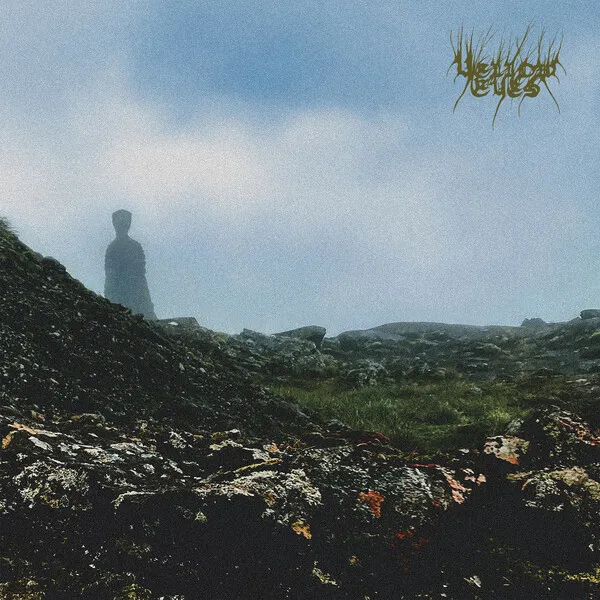
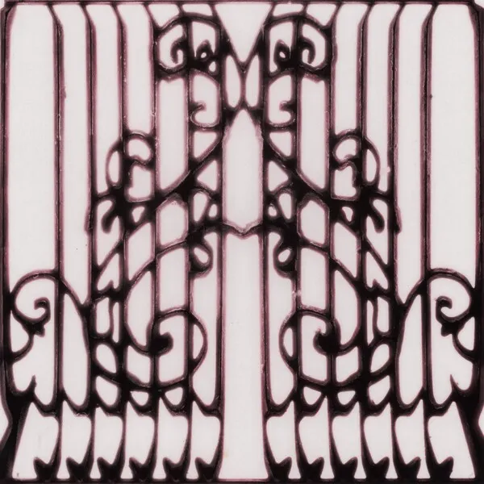
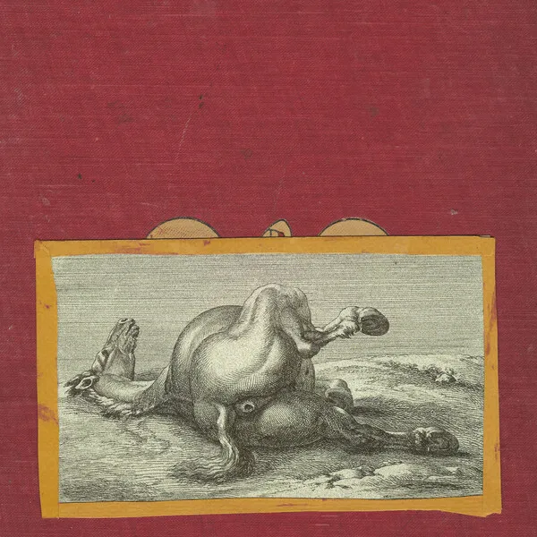
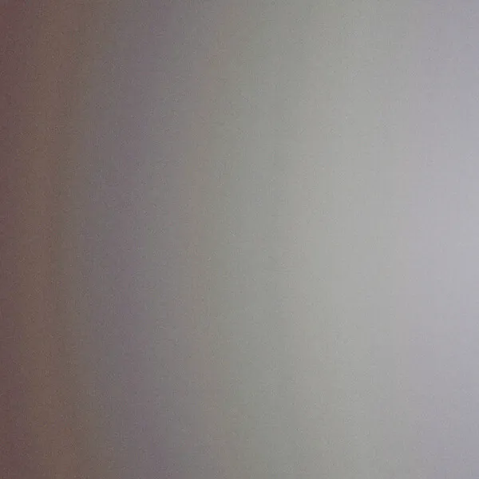
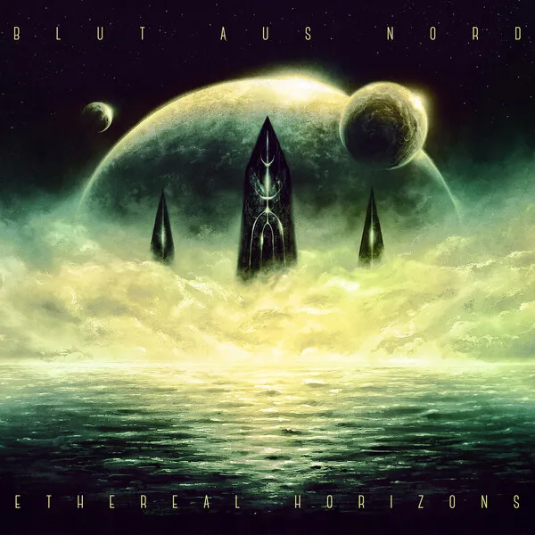
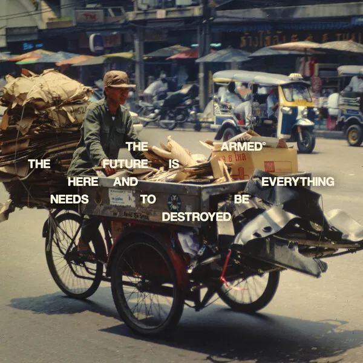

## El top 10

### 1\. Deafheaven \- Lonely People With Power

Creo que todo el mundo estamos con la misma matraca: a estas alturas nadie esperaba nada de **Deafheaven**, una banda absolutamente perdida a nivel creativo, pero han conseguido volver a sus raíces más metaleras integrando el shoegaze, el rock alternativo y demás géneros que habían explorado anteriormente con catastrófico resultado. Nos encontramos ante el mejor trabajo hasta la fecha: nunca habían sonado tan interesantes y emocionantes. Ni siquiera su bochornoso concierto en Madrid ha conseguido empañar mis sensaciones con este disco.

### 2\. Yellow Eyes \- Confusion Gate

Un álbum de black metal que tiene de todo: trvismo, atmósferas, momentos de pensar que el heavy es lo mejor, pero también el riff más melancólico del año. Hay samplers de rebaños de ovejas y de atronadoras campanas. ***Confusion Gate*** no para de lanzar ideas, de desarrollarlas sin abotargar, todo bajo una estructura absolutamente brillante. Una muestra de que se puede hacer música de turisteo sin renunciar a las esencias del género.

### 3\. Model/Actriz \- Pirouette

Yo era ateo pero ahora creo: **Model/Actriz** me parecían una banda de un solo truco, aunque por suerte con ***Pirouette*** han ganado los matices que les echaba en falta. Su nuevo disco es más electrónico y chirriante, pero a su vez se han abierto para sonar más vulnerables que nunca. Su primera mitad me ha acompañado cuando necesitaba ese boost de energía que sólo la música te puede dar.

### 4\. Wednesday \- Bleeds

**Wednesday** son una banda especial para mí, pura *comfort music*: la mejor muestra del revival del rock alternativo noventero que encima se mira en mi banda favorita de género (**The Smashing Pumpkins**, of course). Lo hacen con personalidad, con cercanía, con letras autobiográficas que me apelan mucho aunque traten vivencias tan locales y personales. Y en ***Bleeds***, sin hacer nada nuevo, consiguen mantener el excelente nivel de su discografía.

### 5\. McKinley Dixon \- Magic, Alive

En lo musical, un disco hip hop modernete con ramalazos jazz y soul repleto de arreglos floridos. En lo conceptual, es un trabajo sobre la muerte, el duelo y la búsqueda de la chispa de la vida. Podría haber resultado pretencioso y pesado, pero **McKinley Dixon** hace con ingredientes tan pesados algo precioso y vibrante.

*Goin' through this now, shit, it really got me believin'*  
*To live forever's to tell the stories of who light up your eyes*  
*We ran, we danced, survived, we fly, that's magic alive*

### 6\. Shearling \- Motherfucker, I Am Both: "Amen" and "Hallelujah"

Los restos de **Sprain** siguen forzando la maquinaria y nos traen un trabajo aún más desquiciante y extenuante que su ***The Lamb as Effigy***. Mi pareja dice que no es sano escuchar algo así y seguramente tenga razón, pero es muy liberador escuchar música con tan pocos filtros y que está siempre a punto de descarrilar. Se le puede acusar de ser una sucesión de boutades, pero la única que admito es que sea un solo track.

### 7\. 7038634357 \- Waterfall Horizon

*Final Lap* y *Like a Stone* han sido las canciones con las que más me ha emocionado el año. Un disco que me ha sanado mil veces, donde su extrema calidez nace de la frialdad de los sintetizadores y del vilipendiado vocoder. Son las 8 de la mañana, toda mi familia duerme y es lo que está sonando de fondo mientras escribo esto.

### 8\. Blut Aus Nord \- Ethereal Horizons

No soy un experto de **Blut Aus Nord**, pero probablemente esta sea una de sus obras más accesibles a pesar de sonar a su vertiente más triposa. Dada su dilatada carrera, sorprende que sea un álbum que integra elementos del black metal más moderno (*aka* trémolos, un recurso por el que siento una especial debilidad). Si tuviese que elegir entre los temas de black que más me han gustado este año estaría entre *The Fall Opens The Sky* y *The End Becomes Grace*.

### 9\. Geese \- Getting Killed

Me rindo ante la evidencia: este es uno de los trabajos de indie más estimulantes de los últimos años. Creo que es tentador revolverse ante el unánime entusiasmo de los *busiest music nerds*, de despreciar las hiperbólicas comparaciones y de sospechar si no hay un poco de FOMO en todo esto. Pero a la hora de la verdad, ***Getting Killed*** está guapísimo y es difícil no fantasear en dónde está el techo de esta banda.

### 10\. The Armed \- The Future Is Here And Everything Needs To Be Destroyed

**The Armed** llevaban un par de discos tonteando con dar un salto a audiencias más amplias y este trabajo suena a repliegue tras haberse metido una hostia en el proceso. Aquí tenemos la mejor versión de la banda, la que sabe integrar las vertientes más agresivas del posthardcore con un excelente gusto en las melodías.

## Otros discos

Tengo hecho un top 20 que hice para las votaciones internas de top de [SuicideByStar](https://suicidebystar.com) pero no quiero dar la chapa más de lo necesario, así que ahí va sin comentario para lxs más curiosxs:

11\. **Lucy Gooch** \- ***Desert Window***  
12\. **Billy Woods** \- ***GOLLIWOG***  
13\. **Honningbarna** \- ***Soft Spot***  
14\. **EZEZEZ** \- ***Kabakriba***  
15\. **betcover\!\!** \- ***勇気***  
16\. **The Callous Daboys** \- ***I Don't Want to See You in Heaven***  
17\. **Niños del Cerro** \- ***Alma Tadema***  
18\. **caroline** \- ***caroline 2***  
19\. **Martröð** \- ***Draumsýnir eldsins***  
20\. **Deftones** \- ***Private Music***  

## Fuera de la actualidad

Si algo llevo intentando últimamente es estar menos atado a la actualidad musical, porque aunque sea un flipado tampoco cobro por escuchar novedades y de las cuales me voy a olvidar en dos semanas (en el mejor de los casos). Todo vino a raíz de un 2024 obsesivo escuchando a **Sonic Youth** y dándome cuenta de las cosas guapísimas que me estaba perdiendo por saltar de FOMO en FOMO. De ahí nacieron los ***Deep Dives*** de **SuicideByStar**, que en 2025 me han permitido profundizar en discografías de artistas que tengo en un altar como **Aphex Twin** o **Neurosis**, descubrir los orígenes del black metal desde una perspectiva menos oficialista, dar contexto a los discos de **Unwound** o darme cuenta de que **Cocteau Twins** no me gustan. También ando enfrascado en la lectura de ***Nuestra banda podría ser tu vida***, empapándome de las discografías de cada una de las bandas que aparecen.

Pero si algo ha marcado mi año ha sido mi búsqueda para música para dormir: por circunstancias he pasado muchos meses con insomnio y me terminé comprando un MP3 (perdón, un DAP) en el que cargué música de gente como **Max Richter**, **Jefre Cantu-Ledesma**, **William Basinski** y similares. Aunque ninguna me ha venido mejor que la de todos los proyectos relacionados con **Adam Wiltzie**: **A Winged Victory for the Sullen**, **The Dead Texan** y especialmente **Stars of the Lid**. Muchas gracias allá donde estés.
