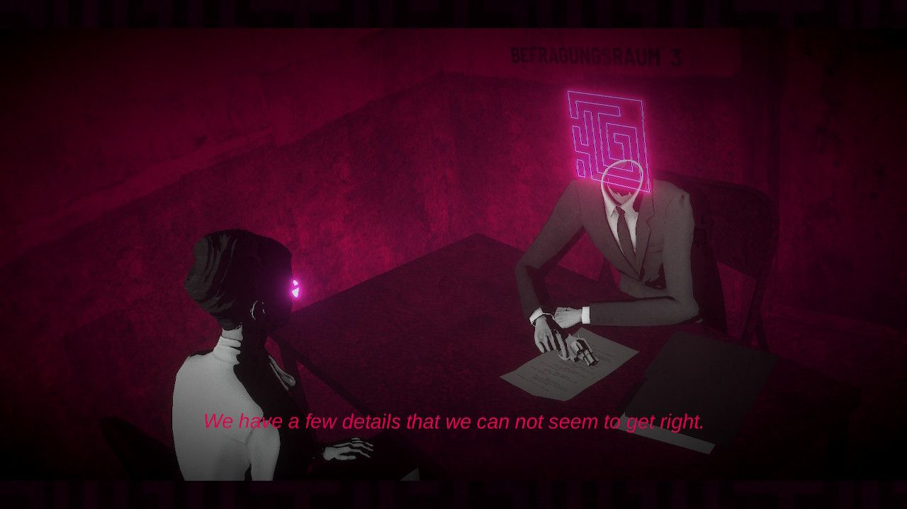
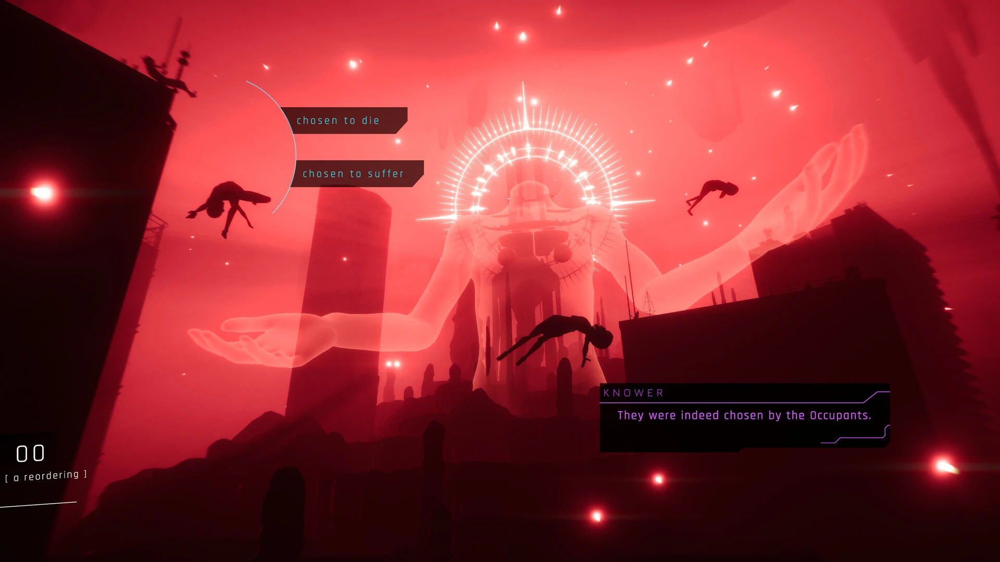
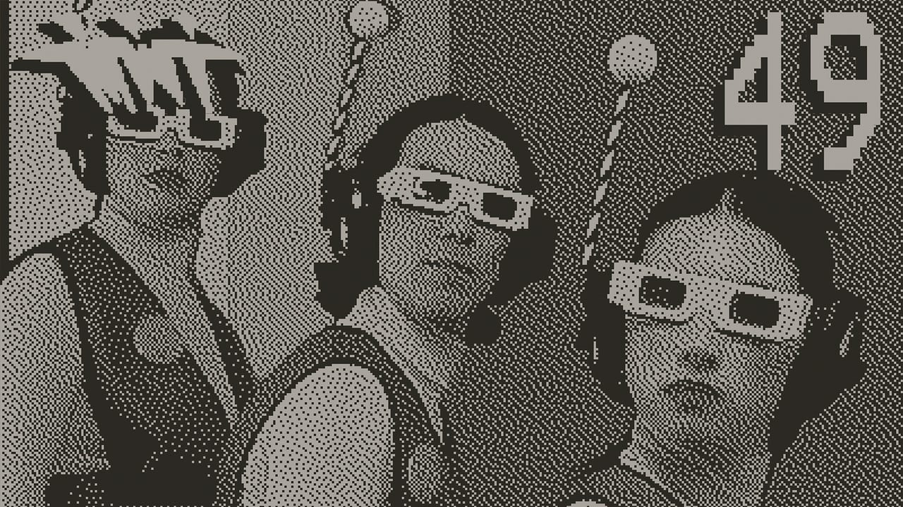

Otro año ha pasado y otro año que he podido jugar bastante más de lo que esperaba. Empecé con la intención de jugar a muchos eternos pendientes, que la vida son dos días, pero eso me ha llevado a unas cuantas decepciones. Vayamos por partes…

## Los GOTYs

Soy una persona que vive algo alejada de las novedades, aunque este año sí que he podido jugar a dos juegos que más me han fascinado. El primero es **Despelote**, obra narrativa donde seguimos a un niño obsesionado con el fútbol, que vive en un Ecuador también obsesionado con la posibilidad de que su selección se clasifique para el Mundial, pero obviamente todo esto es una excusa para hablar de otras cosas (aún así hay momentos de puro *FURBO*). Las autobiografías sobre la infancia están quemadas en otros formatos, sin embargo aquí se explora de una manera que sólo es posible en un videojuego. Cuando lo jugué pensaba que iba a ser como el **Blankets** del medio, aunque parece que se está comiendo una mierda a nivel de ventas, lo que dice mucho de la madurez del mercado videojueguil. Si lees este texto y tienes que llevarte sólo una recomendación que sea esta.

El otro es **Hades II**. No me gustan los roguelikes, aún así **Hades** me encantó y aquí nos encontramos una secuela donde todo es más y mejor. Quizá su mayor virtud es que todas las partidas resultan divertidas: aunque pierdas en los primeros encuentros, siempre hay algo que te anima a seguir, ya sea porque la historia avanza un poquito, consigues un nuevo ingrediente o puedes subir el nivel de alguno de tus recursos. No soy el tipo de persona que tiene un juego al que vuelve continuamente, pero **Hades II** lo ha conseguido: raro es el día que no me hago una *run* a cachos y ratos.

## Otros juegardos

**Lorelei and the Laser Eyes**. Qué decir. Obra maestra del puzzle. Me hizo sentir cosas que no sentía desde **The Witness**. El reflejo de una obsesión. Su historia apunta a cimas a las que termina renunciando, y aún así es un absoluto 10\.

También me obsesionó **Immortality**. Bueno, nos obsesionó, porque lo jugué entero con Raquel. Es casi una peli interactiva, pero eso, casi. No se puede entender de otra manera que no sea con un mando entre las manos. Cosa que puedo decir igualmente de **The Beginner's Guide**, delirio meta sobre la creación artística, tan avanzado y sofisticado que aún teniendo 10 años parece que viene del futuro. Pruebenlo que dura dos ratos.

**1000xRESIST** está también repleto de pirulas narrativas, pero se termina desinflando cuando decide dejar de ser íntimo y se centra en sus aspectos scifi a la **Evangelion**. Aún así la primera mitad es absolutamente formidable, con momentos que son auténtico terrorismo emocional. Es el único juego con el que he llorado este año.

Y luego está **Prey**, que me encantó. No suelo jugar a shooters y me costó entrar, hasta que entendí que no lo estaba jugando mal: la gracia es ir avanzando como puedas aunque tengas que hacer las mayores ñapas, huir como una rata o gastar las últimas balas en un monstruo y rezar que se te ocurra otra forma de avanzar en la siguiente sala. A veces sufrir es divertido.

## La hora del odio

Si algo ha marcado este año es la cantidad de juegos pendientes sobre los cuales tenía grandes expectativas y me han terminado decepcionando. Vamos allá. **The Last Guardian** me pareció molestísimo, tiene un par de trucos que impresionan la primera vez que los ves pero que terminan cansando porque se insiste demasiado en ellos. No quiero faltar a toda la gente que me dijo que aguantara, que el final no me lo iba a esperar, que iba a llorar, etc. Lo siento, todo es previsible, estúpido e infantil (*derogatory*). ¿Es **The Last Guardian** charca? Muchísimo.

**Citizen Sleeper**, del cual he leído mil loas, me pareció bastante mediocre. Ni está bien escrito, mecánicamente está roto y no aporta nada a la scifi *bladerunnera*. El trabajo anterior del estudio, **In Other Waters**, me pareció mucho más estimulante. **Stacklands** hace algo que parece imposible: intentar replicar un juego de mesa y que resulte más farragoso jugarlo en digital que en una hipotética versión física. **The Dredge** y **Strange Horticulture** comparten dos cosas: convertir la obra de **Lovecraft** en algo insípido. **Tunic** me terminó gustando (principalmente gracias al puzzle postgame), pero fuera de lo del manual, bebe tanto de sus influencias que se siente sin alma.

## La misma consola 2

Es un poco sintomático que habiendo salido una consola nueva de Nintendo no la haya nombrado hasta ahora (y si me conoces, sabes que ADORO a Nintendo). Me encanta **Switch 2** y la uso prácticamente todos los días, pero es tan continuista que el salto de la 1 a la 2 ha sido como cambiar de móvil.

Me gustó la frescura de **Donkey Kong Bananza**, un juego sorprendentemente experimental para ser un AAA. Un continuo chute de dopamina (*OH\! BANANA\!*), de ideas estéticas bizarras y mecánicas que usa y tira con una naturalidad pasmosa. El único problema que tiene es que no es **Mario Odyssey**, pero espero que veamos más superproducciones de ***Donkey Kong*** (guapísimo su rediseño, btw).

Y luego está **Mario Kart World**, quizá el juego más complicado de analizar de este texto. Jugablemente es una virguería, nunca la saga tuvo unas carreras tan dinámicas y tan interesantes. Además añade el modo ***Supervivencia*** que creo que ha llegado para quedarse. Por otro lado, está salpicado de fricciones por todos lados (aunque parece que los desarrolladores están escuchando y las van arreglando) y no me queda claro que ampliar las carreras a 24 jugadores haya sido la mejor de las ideas. Es tan generoso en algunos aspectos (en los personajes, en la música, en los circuitos) como timorato en otros (las restricciones en el online o en el ***Modo Libre***). Creo que a base de parches y DLCs se convertirá en el mejor **Mario Kart** ever, pero ahora mismo está en un estado que sólo puedo calificar como raro.

## Lo siento, pero…

…no me compré una **Playdate** para no flexear. Pensaba que iba a ser un cacharro del que me iba a olvidar al mes y que miraría con vergüenza cada vez que me lo encontrase casualmente en un cajón, pero ya llevo varios años jugando a ella prácticamente todas las semanas. Este año me obsesionó **Spilled Mushrooms**, un solitario que me ha acompañado en todas las esperas en el hospital, que no han sido pocas. No es **Balatro**, pero casi, espero que en algún momento salte a otra plataforma más accesible porque es magnífico. También me encantó **Tiny Turnip**, un mini metroidvania plataformero que hace muy buen uso de la palanquita. Este sí que va a contar con una secuela en PC, [os recomiendo que le echéis un ojo](https://www.youtube.com/watch?v=FOApoB-pGHo). Y ahora estoy con **Blippo+**, ese casi inexplicable canal televisivo alienígena en formato videojuego. Lo podéis encontrar [en otras plataformas](https://blippo.plus/).

Hay más cosas a las que he jugado, pero esto ya está quedando largo. Si queréis curiosear, podéis ver todas en mi [**Backloggd**](https://backloggd.com/u/tharandur/journal?page=1), muchos de ellos comentados. Gracias por leerme.
